<!-- ========================================================= -->
<!--                     PROFILE HEADER                        -->
<!-- ========================================================= -->

 

  

---

<!-- ========================================================= -->
<!--                  GITHUB STATS + STREAK                    -->
<!-- ========================================================= -->

---

<!-- ========================================================= -->
<!--                        TECH STACK                         -->
<!-- ========================================================= -->

<h2 align="center">Tech Stack</h2>

  

 

 

---

<!-- ========================================================= -->
<!--              CONTRIBUTION ACTIVITY + OVERVIEW             -->
<!-- ========================================================= -->

<table>
<tr>

<td width="75%" valign="top">

<h2 align="center">Contribution Activity</h2>

</td>

<td width="25%" valign="top">

<h2 align="center">GitHub Overview</h2>

</td>

</tr>
</table>

---

<!-- ========================================================= -->
<!--                 LANGUAGE ANALYTICS                        -->
<!-- ========================================================= -->

<table>
<tr>

<td width="50%">

<h2 align="center">Top Languages by Repo</h2>

</td>

<td width="50%">

<h2 align="center">Top Languages by Commit</h2>

</td>

</tr>
</table>

<!-- ========================================================= -->
<!--                     GITHUB TROPHIES                       -->
<!-- ========================================================= -->

<h2 align="center">GitHub Trophies</h2>

<a href="https://github.com/0xnerd1">
  <b>GitHub Profile</b>
</a>

&nbsp;&nbsp;•&nbsp;&nbsp;

<a href="https://github.com/0xnerd1?tab=repositories">
  <b>Repositories</b>
</a>

&nbsp;&nbsp;•&nbsp;&nbsp;

<a href="https://github.com/0xnerd1?tab=stars">
  <b>Starred Repositories</b>
</a>

&nbsp;&nbsp;•&nbsp;&nbsp;

<a href="https://github.com/0xnerd1?tab=followers">
  <b>Followers</b>
</a>

 

**Contributions • Stars • Projects • Development**

---

<!-- ========================================================= -->
<!--                       PROJECTS                            -->
<!-- ========================================================= -->

<h2 align="center">Featured Projects</h2>

<table>
<tr>

<td width="50%" valign="top">

<h3 align="center">Recon Framework</h3>

A reconnaissance framework designed to automate and simplify security reconnaissance workflows.

<a href="https://github.com/0xnerd1/Recon_Framework">
<b>→ View Repository</b>
</a>

</td>

<td width="50%" valign="top">

<h3 align="center">Secure Chatroom</h3>

An encrypted chat application using secure communication and TLS-wrapped TCP connections.

<a href="https://github.com/0xnerd1/Secure_Chatroom">
<b>→ View Repository</b>
</a>

</td>

</tr>

<tr>

<td width="50%" valign="top">

<h3 align="center">Cloudflare Security Bypass Assessment Tool</h3>

A security assessment tool focused on identifying potential Cloudflare protection weaknesses and bypass scenarios.

<a href="https://github.com/0xnerd1/Cloudflare-Security-Bypass-Assessment-Tool">
<b>→ View Repository</b>
</a>

</td>

<td width="50%" valign="top">

<h3 align="center">Intelligent Local Lead Generation</h3>

A full-stack business intelligence platform for intelligent local lead generation.

<a href="https://github.com/0xnerd1/Intelligent-Local-Lead-Generation-Business-Intelligence-Platform">
<b>→ View Repository</b>
</a>

</td>

</tr>
</table>

---

<!-- ========================================================= -->
<!--                   ACHIEVEMENTS                            -->
<!-- ========================================================= -->

<h2 align="center">Achievements & Certifications</h2>

<table>
<tr>

<td width="50%" align="center">

### NADRA Bug Bounty Challenge 2026

**NADRA**

`FEB 2026`

Vulnerability Assessment & Penetration Testing

**Credential:** `BB-2026-058`

</td>

<td width="50%" align="center">

### Google Cybersecurity Certificate

**Google**

`DEC 2025`

Penetration Testing • VAPT

</td>

</tr>

<tr>

<td width="50%" align="center">

### Cyber Security Technologies

**Illinois Institute of Technology**

`NOV 2025`

**Credential:**  
`bf7ce8b6dfe2eacb4832e28b27fae2bc`

</td>

<td width="50%" align="center">

### Google IT Support

**Google**

`DEC 2025`

**Credential:**  
`EZVCO3P7CK8O`

</td>

</tr>

<tr>

<td width="50%" align="center">

### Advanced Linux & Network Security

**Packt**

`AUG 2025`

Linux System Administration • Networking

</td>

<td width="50%" align="center">

### Advanced Cyber Security

**Great Learning**

Threat Intelligence • Red Teaming

</td>

</tr>
</table>

---

<!-- ========================================================= -->
<!--                     CONNECT                               -->
<!-- ========================================================= -->

<h2 align="center">Connect With Me</h2>

